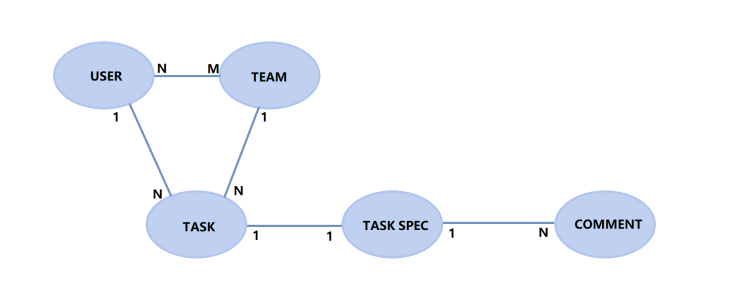

# ASOS_BE
## Tymovi projekt

Tento backend je postavený na frameworku FastAPI a poskytuje REST API na správu používateľov a komunikáciu s databázou. Obsahuje implementáciu registrácie, prihlasovania a spracovania údajov uložených v databáze.


### Funkcie
- Registrácia používateľov: Bezpečné pridávanie nových používateľov s hashovaním hesiel.
- Prihlasovanie používateľov: Overenie údajov a vydávanie JWT tokenov na autentifikáciu.
- Komunikácia s databázou: Zabezpečená správa údajov pomocou moderných databázových nástrojov.
- REST API: Štruktúrované API umožňujúce integráciu s frontend aplikáciami.

## Lokálne rozbehanie
Pre lokálne rozbehanie je potreba zadať príkaz nižšie do konzoly

```
uvicorn main:app --host 0.0.0.0 --port 8000 --ssl-keyfile=keys/selfsigned.key --ssl-certfile=keys/selfsigned.crt
```

Násladne nám backend bude počúvať na porte https://localhost:8000

## Docker rozbehanie

Aby sa aplikácia dala spustiť v dockeri je potreba vytvoriť si priečinok a doňho naclonovať
obidva repozitáre [repo-backend](https://github.com/xballad/ASOS_BE) a [repo-frontend](https://github.com/xballad/ASOS_BE)

Následne treba do konzoly byt v priecinku asos-fe a zadať príkaz
```
docker-compose up
```

## Rest service 
Tie si vieme lahko dohladať na swaggeri

```
https://localhost:8000/docs#/
```

## DB model
